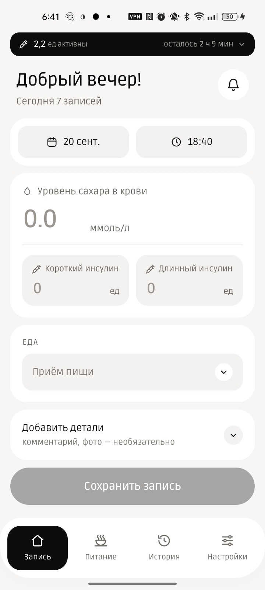
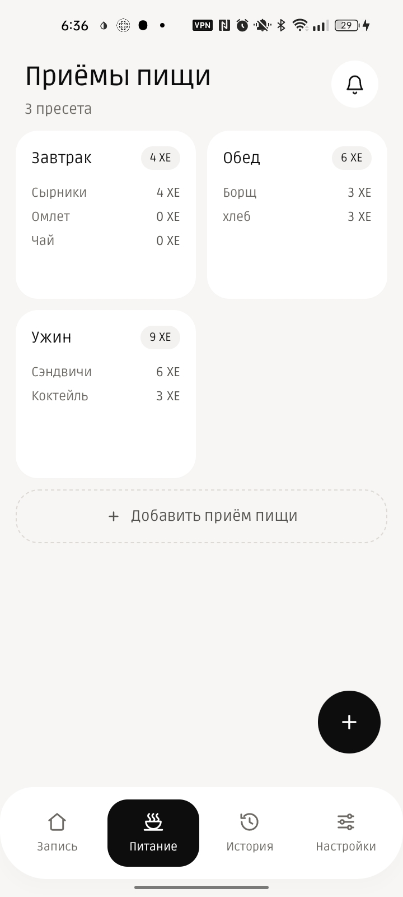
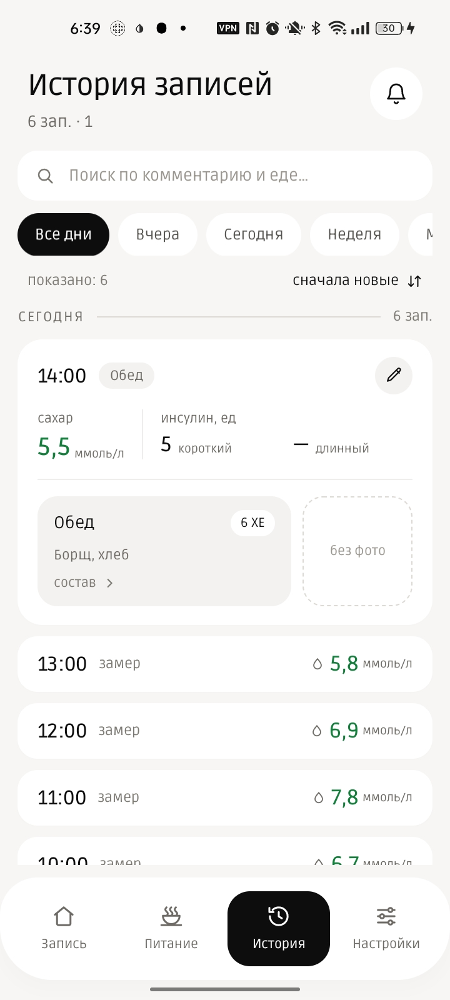

# DiaX-Tracker

Личный дневник для людей с диабетом: сахар, инсулин, еда и заметки — в одном месте, без облака
и без аккаунтов. Все данные хранятся только на устройстве.

| Запись | Питание | История |
| --- | --- | --- |
|  |  |  |

## Возможности

- Быстрая запись: сахар, ХЕ, короткий/длинный инсулин, приём пищи, фото и комментарий
- Пресеты питания с составом и автоматическим подсчётом ХЕ
- Активный инсулин на главном экране — расчёт по фармакокинетической модели
  (экспоненциальный спад, как в Loop/AndroidAPS/OpenAPS), с настраиваемой длительностью действия
- История записей с поиском, фильтрами по датам и подсветкой значений вне целевого диапазона
- Импорт/экспорт данных в ZIP-архив, автобэкап
- Поддержка датчика непрерывного мониторинга (подстановка сахара из показаний сенсора)
- Русский и английский интерфейс

## Важно

DiaX-Tracker — личный дневник для собственных записей, а не медицинское изделие. Приложение
не даёт рекомендаций по лечению и не рассчитывает дозы инсулина: все показатели на экране
(включая оценку активного инсулина) носят исключительно информационный характер и не заменяют
консультацию врача. Все решения о лечении пользователь принимает самостоятельно и несёт за них
полную ответственность. Полный текст — в дисклеймере при первом запуске приложения.

## Сборка и запуск

Требуется Android Studio (или Gradle + JDK 17) и подключённое устройство/эмулятор с Android 8.0
(API 26) или новее.

```bash
./gradlew installDebug
```

## Стек

Kotlin, Jetpack Compose, Material3, Room, WorkManager, Coil.

## Лицензия

[MIT](LICENSE)
