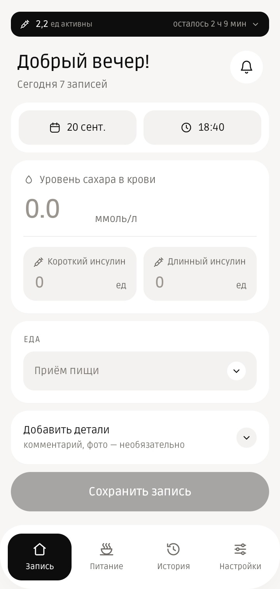
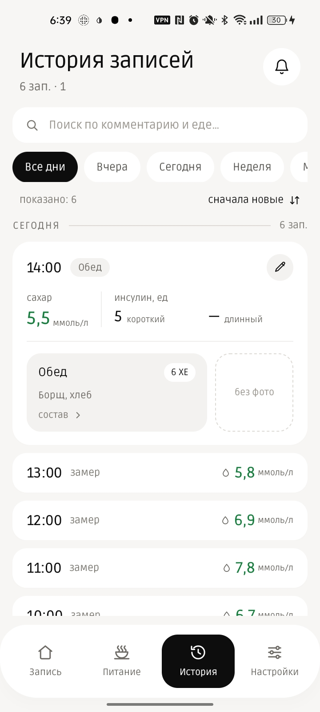
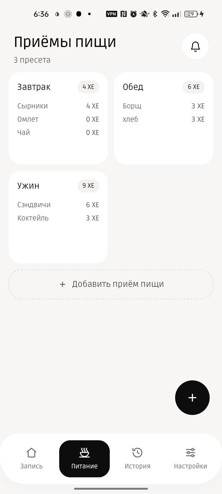

# DiaX-Tracker

English | [Русский](README.ru.md)

[](https://github.com/neojelll/DiaX-Tracker/actions/workflows/ci.yml)
[](https://github.com/neojelll/DiaX-Tracker/releases/latest)

A personal diary for people with diabetes: blood sugar, insulin, meals, and notes — all in
one place, with no cloud and no accounts. All data stays on the device.

**Status: beta.** The app is in active development; some features are still rough, and a
database change between versions can mean an archive exported by a newer version won't
import into an older one. See [Limitations](#limitations) below.

| Entry | History | Meal presets |
| --- | --- | --- |
|  |  |  |

## Contents

- [Features](#features)
- [Getting the app](#getting-the-app)
- [Connecting a sensor source](#connecting-a-sensor-source)
- [Your data, backup and privacy](#your-data-backup-and-privacy)
- [Limitations](#limitations)
- [What this app is not](#what-this-app-is-not)
- [Building from source](#building-from-source)
- [Contributing](#contributing)
- [License](#license)

## Features

### Logging

- Quick entry: blood sugar, carb units (XE), short/long insulin, meal, a photo (camera or
  gallery), and a comment
- Meal presets with ingredients and automatic carb-unit calculation
- Automatic blood sugar fill-in from **xDrip+** and **Juggluco** — no need to retype sensor
  readings by hand

### On the home screen

- Active insulin: calculated with a pharmacokinetic model (exponential decay, as in
  Loop/AndroidAPS/OpenAPS), with configurable action duration

### History

- Search, date filters, and highlighting for out-of-range values
- Tap a card to edit it, tap a meal to see its composition
- "Sugar after a meal": automatic checks at +1h/+2h/+3h/+4h, shown as a pill on the meal's
  own card
- A reminder of what was eaten at this same time yesterday

### Data

- Export to a ZIP archive (a week, a month, or everything) and import that merges instead of
  replacing, skipping duplicates
- Automatic nightly backup to a folder you choose, keeping the newest 7 copies
- Undo for deleting an entry, a meal, or everything

### Interface

- Russian and English

## Getting the app

Download the latest APK from the [Releases page](https://github.com/neojelll/DiaX-Tracker/releases/latest)
and install it (you'll need to allow installs from that source once). Requires Android 8.0
(API 26) or newer.

The app isn't on Google Play yet.

## Connecting a sensor source

DiaX-Tracker doesn't talk to a sensor directly — it receives readings that another app
already broadcasts on the device:

- **xDrip+**: in xDrip+'s settings, under *Inter-app settings*, enable
  *"BroadcastReceiver mode"* (or the mmol/L equivalent your build uses to send local
  broadcasts) so it sends the standard `com.eveningoutpost.dexdrip.BgEstimate` broadcast.
- **Juggluco / JugglucoNG**: in Juggluco's settings, add DiaX-Tracker as a *Glucodata*
  recipient (or enable its xDrip-compatible broadcast mode).

Once enabled, readings appear in DiaX-Tracker automatically — nothing needs to be
configured on the DiaX-Tracker side. If a screen ever shows a stale-sensor warning, re-check
the broadcast setting in the source app first.

## Your data, backup and privacy

- Everything - entries, photos, presets, sensor readings - is stored locally in the app's
  own storage. Nothing is sent anywhere; there is no server, account, or analytics.
- **Export**: Settings → export a ZIP archive for a week, a month, or all your data.
- **Import**: adds the entries from an archive to what's already there; entries that match
  exactly are skipped as duplicates, and nothing existing is changed or deleted.
- **Automatic backup**: turn it on in Settings and pick a folder (e.g. one synced by your
  own cloud provider); every evening the app writes a new archive there and keeps the
  newest 7, deleting only its own older ones.
- **Permissions**: a foreground service to receive sensor broadcasts and run the automatic
  backup and reminder checks in the background. The camera and photo picker are opened as
  the system's own apps, so no separate storage/camera permission is requested.
- Uninstalling the app deletes its data. Export or turn on automatic backup first if you
  want to keep it.

## Limitations

- **Beta software**: expect rough edges and occasional bugs.
- **Schema changes**: a database change between versions is not undone by downgrading —
  going back to an older build after updating isn't supported. An archive exported by a
  newer version may not import into an older one; the other direction (old archive into a
  new version) is supported.
- **Background reliability**: automatic backup and the post-meal sugar checks depend on
  Android's background scheduling (WorkManager); aggressive battery optimisation on some
  phones (Xiaomi, Oppo/Realme, and similar) can delay or skip a run. Exclude the app from
  battery optimisation if you rely on these.
- Not on Google Play yet - see [Getting the app](#getting-the-app).

## What this app is not

DiaX-Tracker is a personal diary for your own records, not a medical device. The app does
not give treatment recommendations or calculate insulin doses: every figure on screen
(including the active-insulin estimate and the automatic sugar checks) is purely
informational and does not replace a doctor's advice. The user makes all treatment
decisions independently and bears full responsibility for them. The full text is in the
disclaimer shown on first launch.

## Building from source

Requires Android Studio (or Gradle + JDK 17) and a connected device/emulator running
Android 8.0 (API 26) or newer.

```bash
./gradlew installDebug
```

**Stack**: Kotlin, Jetpack Compose, Material3, Room, WorkManager, Coil.

## Contributing

This is currently a solo, personal project, but issues and pull requests are welcome.

- Branches: `[issue-number/]type/slug` (e.g. `104/feat/after-meal-sugar`).
- Commits and PR titles follow [Conventional Commits](https://www.conventionalcommits.org/)
  (`feat: …`, `fix: …`, …) - a squash-merged PR's title becomes the commit on `main`, and
  the changelog is generated from it.
- `./gradlew testDebugUnitTest lintDebug` should pass before opening a PR; CI runs the same
  checks.
- See the [open issues](https://github.com/neojelll/DiaX-Tracker/issues) for what's planned
  or being considered - most start as a loosely defined idea and get refined before anyone
  picks them up.

## License

[MIT](LICENSE)
